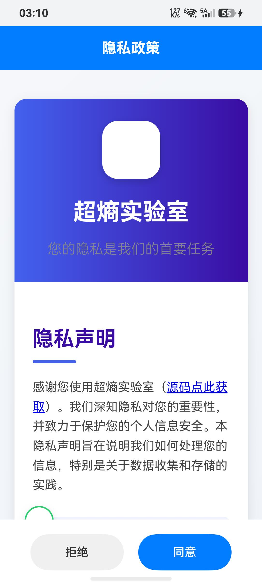

# TC01: 首次安装，未同意隐私 → Web服务不启动

**用例描述**: 全新安装应用后，在未同意隐私协议前，Web服务不应启动。

**前置条件**: 应用已卸载，全新安装。

**测试步骤**:
1. 安装应用
2. 启动应用
3. 等待隐私页面显示
4. 截图记录
5. 检查 Port 8088 监听状态
6. 检查悬浮窗状态

**预期结果**:
- Port 8088 不处于 LISTEN 状态
- 无 FloatBallWindow 悬浮窗
- 应用停留在隐私页面

**实际结果**: ✅ 通过
- Port 8088: 未监听
- Float 窗口: 无
- 截图: 见 screenshot.jpeg

