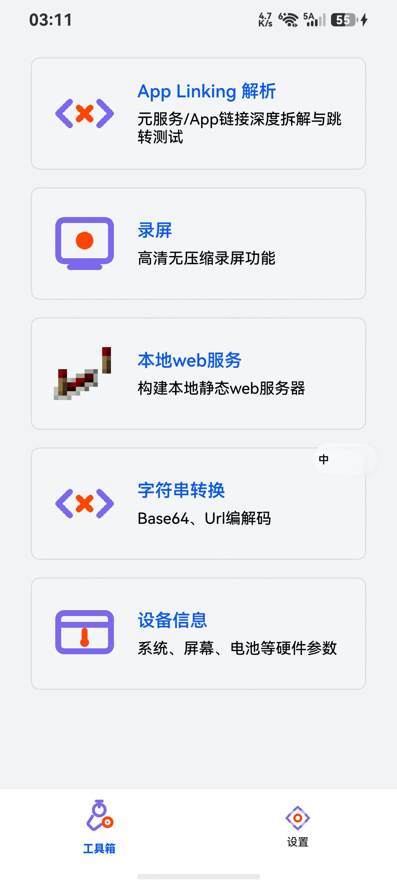

# TC02: 同意隐私 → Web服务立即启动

**用例描述**: 在隐私页面点击「同意」后，Web 服务应在此次会话中立即启动。

**前置条件**: 已完成 TC01，应用显示隐私页面。

**测试步骤**:
1. 在隐私页面点击「同意」按钮 (761, 2347)
2. 等待页面跳转至主页
3. 截图记录
4. 检查 Port 8088 监听状态
5. 检查 FloatBallWindow 悬浮窗
6. 检查 Preferences 文件

**预期结果**:
- Port 8088 处于 LISTEN 状态
- FloatBallWindow 悬浮窗可见
- `privacy_agree` 写入 Preferences

**实际结果**: ✅ 通过
- Port 8088: LISTEN
- FloatBallWindow: WindowId 560
- Preferences: `privacy_agree = true`
- 截图: 见 screenshot.jpeg

