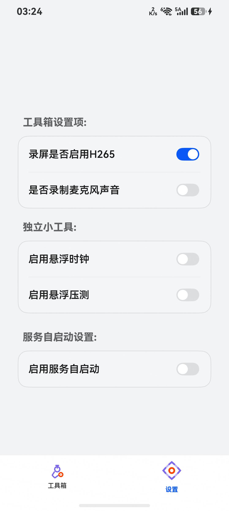

# TC04: 关闭服务自启 → 服务停止 + 状态不记录

**用例描述**: 在设置页关闭「服务自启动」开关，运行中的服务立即停止，且后续开关切换不记录状态。

**前置条件**: 应用在主页，自启开关为 ON（`auto_start_enabled=true`）。

**测试步骤**:
1. 点击底部 Tab「设置」→ 中心 (813, 2280)
2. 定位「启用服务自启动」Toggle：[835,1712]-[943,1772]，中心 (889, 1742)
3. `uitest uiInput click 889 1742` 关闭开关
4. 检查 Preferences、Port 8088、FloatBallWindow

**预期结果**:
- `auto_start_enabled = false`
- Web 服务立即停止（Port 8088 无监听，FloatBallWindow 消失）

**实际结果**: ✅ 通过 (页面操作)
- Toggle 点击: `uitest uiInput click 889 1742` → No Error
- Port 8088: 无监听
- Float 窗口: 无
- Preferences: `auto_start_enabled = false`
- 截图: 见 screenshot.jpeg

