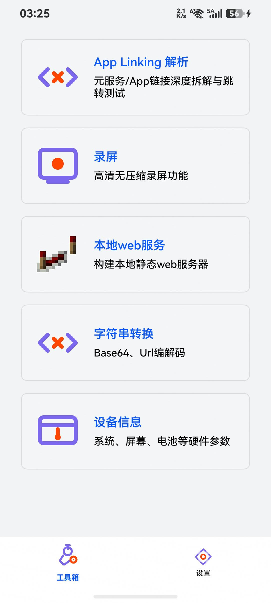

# TC05: 启用自启 + WEB_SERVER=false → 重启不启动

**用例描述**: 「服务自启动」开启时，用户通过 LocalWebPage 关闭 Web 服务并保存状态（`web_server_on=false`），重启后不应自动启动 Web 服务。

**前置条件**: TC04 完成后，自启已关闭。在设置页将自启重新打开。

**测试步骤**:
1. 点击 Toggle (889, 1742) 打开「启用服务自启动」
2. 确认 Preferences 中 `auto_start_enabled=true, web_server_on=false`
3. `aa force-stop` + `aa start` 重启应用
4. 检查 Port 8088 / FloatBallWindow / StateRestore 日志

**预期结果**:
- Port 8088 不处于 LISTEN 状态
- 无 FloatBallWindow
- 日志显示 `web server skip`

**实际结果**: ✅ 通过 (页面操作)
- Toggle 点击: `uitest uiInput click 889 1742` → No Error
- Port 8088: 未监听
- Float 窗口: 无
- 日志: `WEB_SERVER_ON = false → web server skip`
- 截图: 见 screenshot.jpeg

```
[StateRestore] reading FLOAT_CLOCK_ON = false → skip
[StateRestore] reading CPU_STRESS_ON  = false → skip
[StateRestore] reading WEB_SERVER_ON  = false → skip
```


